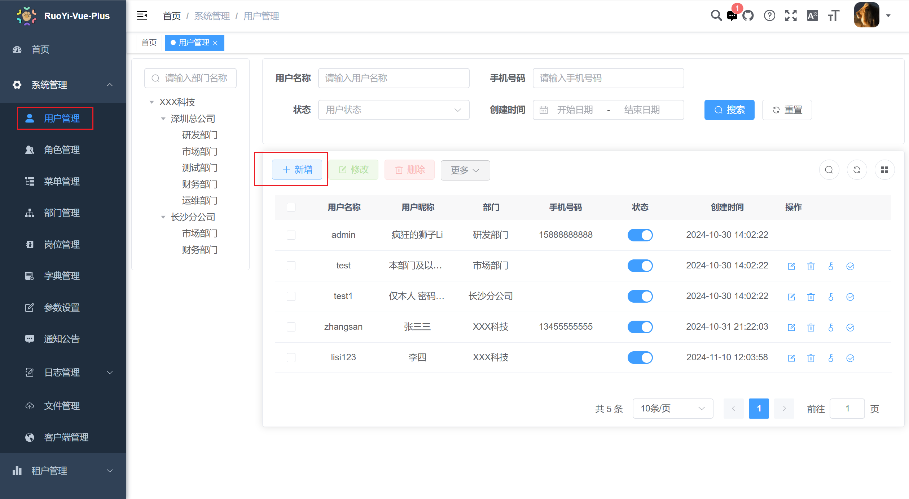
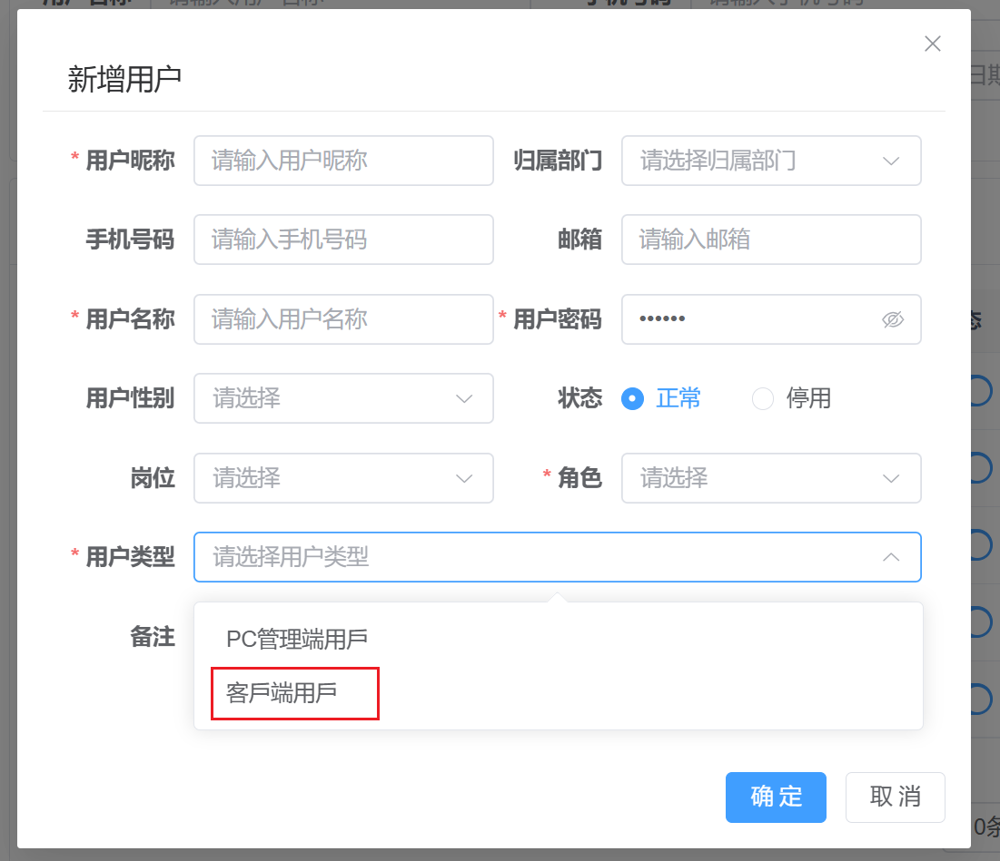
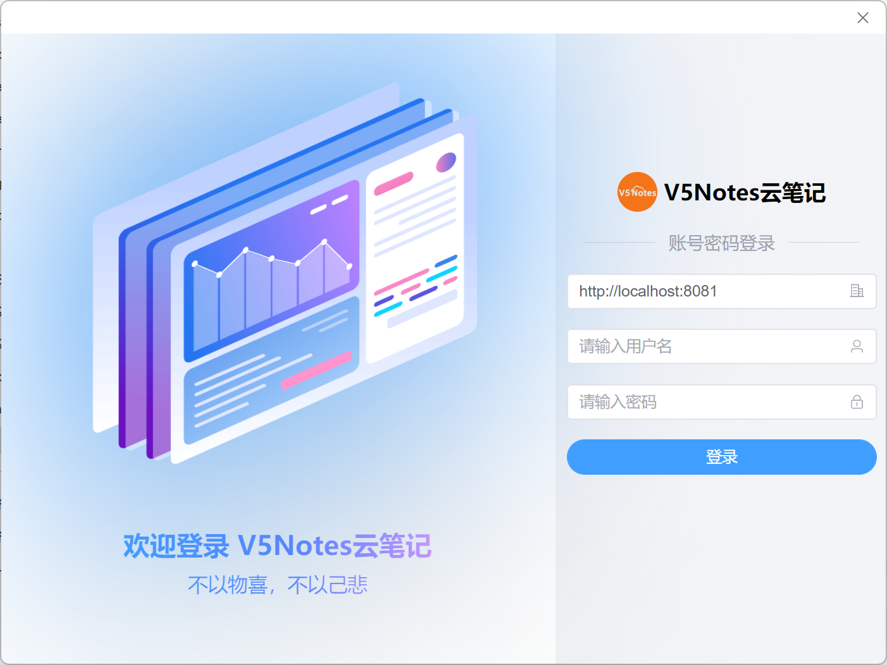
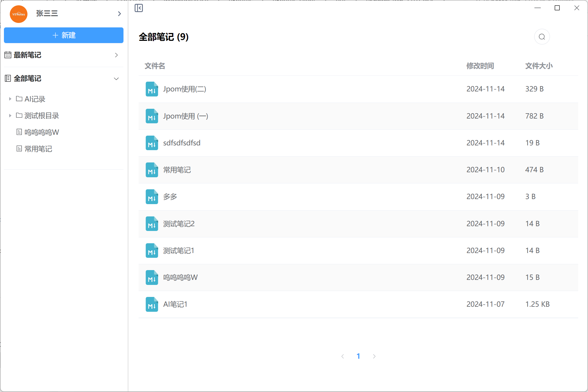
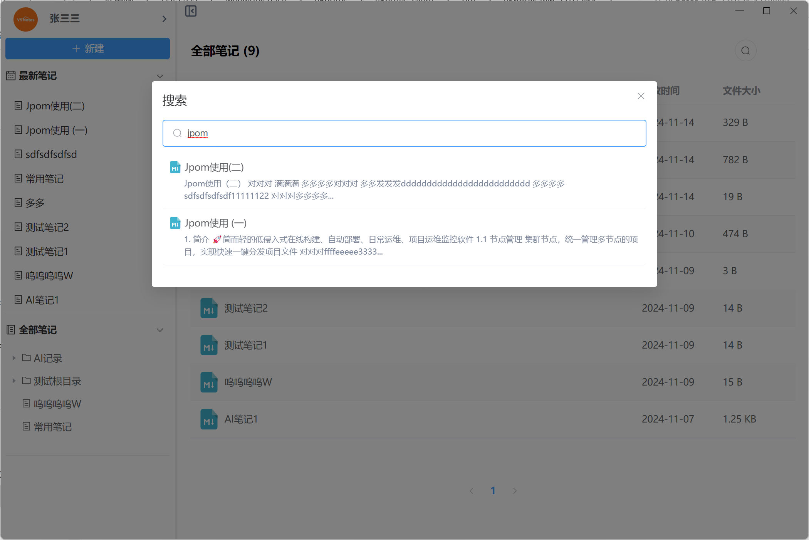
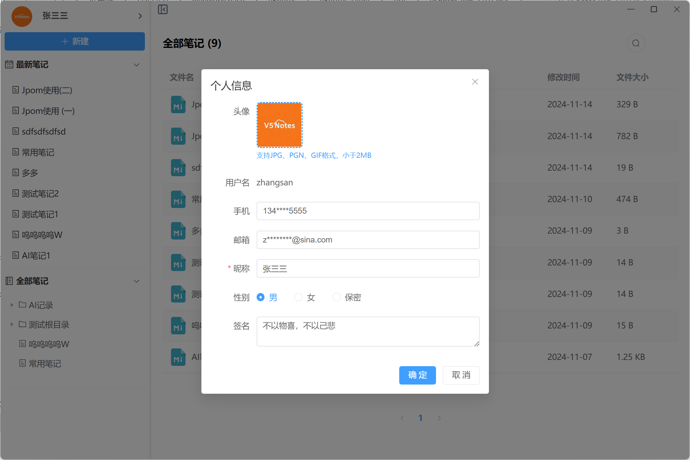
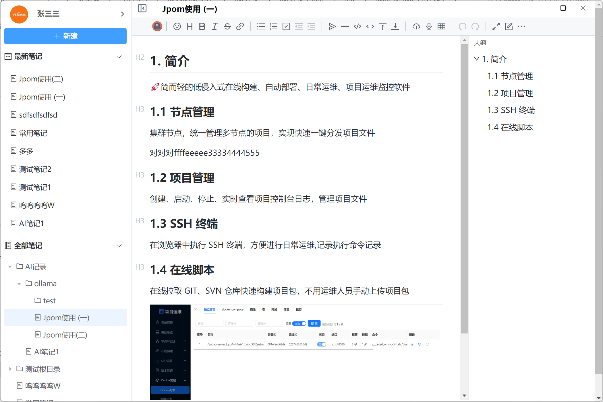
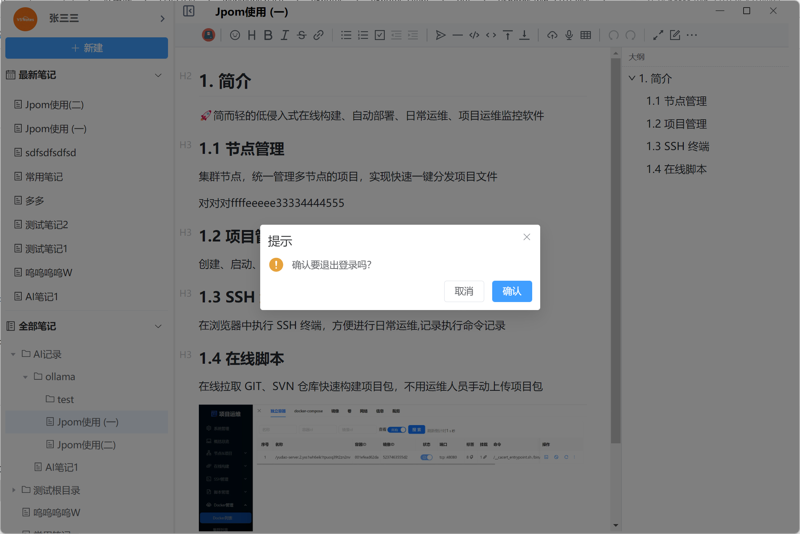

# 1. 项目介绍

这是一个简单好用私有部署的云笔记项目。

项目分为一下几部分：

1. `v5notes`后端`API`服务，使用`Java`语言开发，基于`RuoYi-Vue-Plus`快速脚手架开发。
2. `v5notes-admin`后端管理前端页面，也是基于的`RuoYi-Vue-Plus`前端部分开发的。
3. `v5notes-client`云笔记客户端部分，是基于`electron`和`electron-egg`开发。

# 2. 开发原由

其一：我经常会在电脑上创建一个Markdown文档来保存一些敏感信息，比如秘密、开放平台的API Key。不想保存到像有道云笔记这样的非私有部署的云笔记上。但是这些信息在公司电脑上有一份，家里笔记本，台式机上都有一份。这样就导致了信息碎片化不能同步。

其二：家里有一台闲置的Mac mini电脑。最近在家把它折腾成了一台服务器（PVE+OpenWRT+Lucky+FnOS），使用IPv6地址和DDNS绑定域名。所以可以不买云服务部署一个私有云笔记了。

# 3. 部署

1. 后端API服务和后端管理页面部署可以参考`RuoYi-Vue-Plus`的部署方法[RuoYi-Vue-Plus部署](https://plus-doc.dromara.org/#/ruoyi-vue-plus/home)
2. 下载`v5notes-client`客户端连接上就可以使用了。

# 4. 项目地址

Github: https://github.com/zyw/v5notes

Gitee: https://gitee.com/zyw/v5notes.git

均可下载客户端安装文件和免安装压缩包。

# 5. 创建用户

创建客户端用户时，用户类型一定要选择【客户端用户】

# 6. 截图

